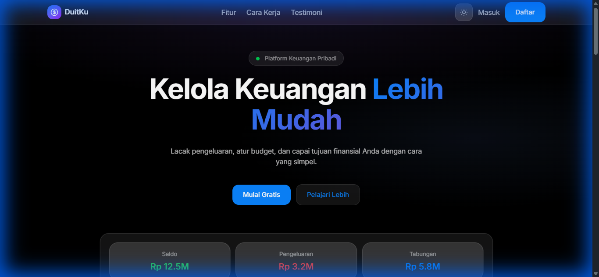
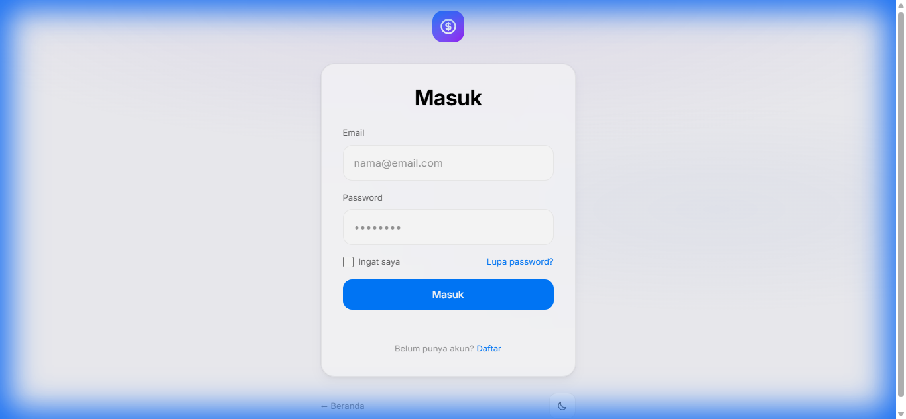
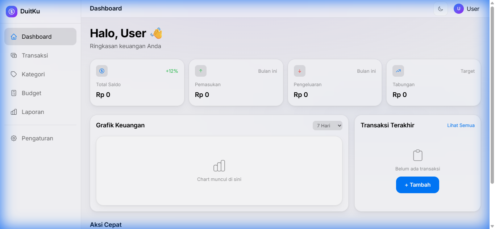

<p align="center">
  
</p>

<h1 align="center">💰 DuitKu</h1>

<p align="center">
  <strong>Platform Manajemen Keuangan Pribadi Modern</strong>
</p>

<p align="center">
  <a href="#features">Features</a> •
  <a href="#screenshots">Screenshots</a> •
  <a href="#tech-stack">Tech Stack</a> •
  <a href="#installation">Installation</a> •
  <a href="#usage">Usage</a> •
  <a href="#license">License</a>
</p>

<p align="center">
  
  
  
  
</p>

---

## ✨ Features

- 🌙 **Modern Dark Theme** - Eye-catching AI-style design dengan gradient backgrounds dan glow effects
- 💳 **Expense Tracking** - Lacak pengeluaran dan pemasukan dengan mudah
- 📊 **Budget Management** - Buat dan kelola budget untuk setiap kategori
- 🎯 **Savings Goals** - Set target tabungan dan pantau progres
- 📈 **Visual Reports** - Laporan keuangan dengan visualisasi chart
- 🔐 **Secure Authentication** - Sistem login dan register yang aman
- 📱 **Responsive Design** - Tampil sempurna di semua perangkat

---

## 📸 Screenshots

<details>
<summary><strong>🏠 Landing Page</strong></summary>
<br>

</details>

<details>
<summary><strong>🔐 Authentication</strong></summary>
<br>

</details>

<details>
<summary><strong>📊 Dashboard</strong></summary>
<br>

</details>

---

## 🛠 Tech Stack

| Technology | Version | Description |
|------------|---------|-------------|
| **Laravel** | 12.x | PHP Framework |
| **Tailwind CSS** | 4.x | Utility-first CSS |
| **DaisyUI** | 5.x | Tailwind CSS Components |
| **Vite** | 7.x | Frontend Build Tool |
| **MySQL/SQLite** | - | Database |

---

## 🚀 Installation

### Prerequisites

- PHP >= 8.2
- Composer
- Node.js >= 18.x
- npm atau yarn

### Steps

1. **Clone repository**
   ```bash
   git clone https://github.com/your-username/duitku.git
   cd duitku
   ```

2. **Install PHP dependencies**
   ```bash
   composer install
   ```

3. **Install Node.js dependencies**
   ```bash
   npm install
   ```

4. **Setup environment**
   ```bash
   cp .env.example .env
   php artisan key:generate
   ```

5. **Configure database**
   
   Edit `.env` file dan sesuaikan database credentials:
   ```env
   DB_CONNECTION=mysql
   DB_HOST=127.0.0.1
   DB_PORT=3306
   DB_DATABASE=duitku
   DB_USERNAME=root
   DB_PASSWORD=
   ```

6. **Run migrations**
   ```bash
   php artisan migrate
   ```

7. **Start development servers**
   ```bash
   # Terminal 1 - Laravel server
   php artisan serve

   # Terminal 2 - Vite dev server
   npm run dev
   ```

8. **Open browser**
   
   Navigate to `http://localhost:8000`

---

## 📁 Project Structure

```
duitku/
├── app/
│   ├── Http/
│   │   └── Controllers/
│   └── Models/
├── resources/
│   ├── css/
│   │   └── app.css          # Custom styles & theme
│   ├── js/
│   └── views/
│       ├── auth/             # Login & Register
│       ├── components/       # Blade components
│       │   ├── app-layout.blade.php
│       │   ├── auth-layout.blade.php
│       │   ├── dashboard-layout.blade.php
│       │   └── landing-layout.blade.php
│       ├── dashboard/        # Dashboard views
│       └── landing.blade.php # Landing page
├── routes/
│   └── web.php              # Web routes
└── public/
    └── screenshots/         # README screenshots
```

---

## 🎨 Design System

### Color Palette

| Color | Usage |
|-------|-------|
| `purple-600` | Primary accent |
| `pink-600` | Secondary accent |
| `blue-600` | Info elements |
| `mesh gradient` | Background |

### CSS Custom Classes

| Class | Description |
|-------|-------------|
| `.glass-card` | Glassmorphism card effect |
| `.glow-primary` | Purple glow shadow |
| `.text-gradient` | Gradient text |
| `.btn-glow` | Button with glow hover |
| `.orb` | Floating background orbs |

---

## 📝 Usage

### Routes

| Route | Description |
|-------|-------------|
| `/` | Landing page |
| `/login` | Login page |
| `/register` | Register page |
| `/dashboard` | Dashboard (requires auth) |
| `/logout` | Logout |

---

## 🤝 Contributing

Contributions are welcome! Please feel free to submit a Pull Request.

1. Fork the project
2. Create your feature branch (`git checkout -b feature/AmazingFeature`)
3. Commit your changes (`git commit -m 'Add some AmazingFeature'`)
4. Push to the branch (`git push origin feature/AmazingFeature`)
5. Open a Pull Request

---

## 📄 License

This project is open-sourced software licensed under the [MIT license](https://opensource.org/licenses/MIT).

---

<p align="center">
  Made with ❤️ by <a href="https://github.com/humdiess">Humdiess</a>
</p>
